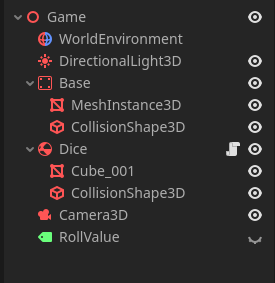

# Video Tutorial
I highly recommended watching this tutorial since it is much easy to follow along.
<iframe width="560" height="315" src="https://www.youtube.com/embed/MFV5YBkjqyY?si=HpWR5FZMiq-or62S" title="YouTube video player" frameborder="0" allow="accelerometer; autoplay; clipboard-write; encrypted-media; gyroscope; picture-in-picture; web-share" referrerpolicy="strict-origin-when-cross-origin" allowfullscreen></iframe>
<br/>
<br/>

# Tree Structure

This is the node tree strcuture that we need in this tutorial.
I have scaled down dice mesh to `0.1` to make it look realastic. If you want same behaviour with different dice, you have to play with gravity and torque force.



# Scripting
Attach a script to `Dice` node and call it `dice.gd`, open it and lets start coding.

We will start by defining some variables or signals, which we can emit on specific cases

```gdscript
extends RigidBody3D

# This value will be used to reset global_position
@onready var initial_position: Vector3 = global_position;

# A reference to label node which shows the dice outcome
@export var roll_value: Label;

# A flag to track if dice is rolling or not
var is_rolling: bool = false;

func _ready() -> void:
    randomize()
```


Lets define roll method.
```gdscript
func roll() -> void:
    roll_value.hide()
    is_rolling = true;
    sleeping = false;
    
    # Reset to initital
    global_position = initial_position;
    linear_velocity = Vector3.ZERO
    linear_velocity = Vector3.ZERO
    
    # Randomize dice rotation
    rotation_degress = Vector3(
      randi_range(1, 360),
      randi_range(1, 360),
      randi_range(1, 360),
    )
    
    # Add rotational force to the dice at once
    apply_torque_impulse(Vector3.ONE * 0.08)
```


Lets make input handler and add other logic.
```gdscript
if Input.is_action_just_pressed("ui_accept"):
    roll()
    
# Sleeping is a RigidBody3D property which we
# can use to detect whether our rigidbody is at rest or in motion.  
# When our dice is sleeping and is_rolling is true,
# we can say that our dice just stopped moving,
# so it's time to compute roll_value and update the label
if sleeping and is_rolling:
    is_rolling = false;
    roll_value.show()
    roll_value.text = "You Rolled: %s" % get_roll_value()
    # Instead of this we can also emit a signal, something like
    # dice_rolled.emit(get_roll_value())
```


Logic to get top face value.
```gdscript
func get_roll_value() -> int:
    # we are trying to find which dice face is upward side, but you can change this value to detect any side of dice.
    var world_up = Vector3.UP
    var threshold = 0.9;
    var max_dot = -1;
    
    var sides = {
        transform.basis.y: 1, # Top
        -transform.basis.y: 6, # Bottom
        transform.basis.x: 5, # Right
        -transform.basis.x: 2, # Left
        transform.basis.z: 3, # Screen Side (You)
        -transform.basis.z: 4, # Backwards
    }

    var value = -1;
    for side in sides:
        var  dot_product = world_up.dot(side.normalized())
        # If dot_product of current side is greator than threshold and greator than max_dot
        # we will assume that's our favorable value.
        if dot_product > threshold and dot_product > max_dot:
            max_dot = dot_product
            value = sides[side]
            

    return value
```