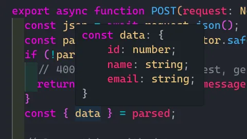

TypeScript with Next.js is an excellent choice because TypeScript helps us detect and rectify many bugs that might slip through when using JavaScript.

However, it's important to note that while TypeScript adds types, we can't ensure the exact contents of an object.

For instance:

```ts
type Student = {
  id name;
  name string;
}
var student: Student = {} // @ts-ignore
```
In the above code, I deliberately added `@ts-ignore` to demonstrate what I meant. When we try to use student.name, it doesn't give us an error either at compile time or runtime because TypeScript types aren't validated at runtime.

To prevent this behavior, we employ Zod validation, which not only provides validation but also offers static types for our objects.

### Why can't we trust the request?
Web requests can originate from any source, including potentially malicious ones. We can't expect users to always input data in the correct format that we accept, so we have to use Zod as a middleware between requests and users.

### How does Zod work?
You start by defining a schema, which you then use to parse the incoming data. Zod handles errors itself, known as issues in Zod. You can create custom issues for specific conditions.

Zod comes with many built-in data types and parsers such as `string`, `number`, `boolean`, `date`, `file`, `email`, etc. You can use the builder method to stack these up on each other, such as `.string().email()`

By default, Zod doesn't attempt to cast types to other types. For instance, if your schema expects a string and the data passed is a number, Zod will not typecast it for safety reasons. However, if you still want typecasting, you can use the .coerce builder method.

### Can I use Zod for client side validation?
Yes, zod can be used on both server and client side validation, react-hook-form provides a zod resolver which you can use to validate on client side, but that's a topic for another day.


### Let's dive into code
#### Defining a schema
```ts
import {z} from "zod";

const studentValidator = z.object({
  id: z.number(),
  name: z.string(),
  email: z.string().email()
})t
```

We defined a schema called `studentValidator` which validates the inputs for student data.

Zod have many parsers can these parsers can stack onto each other, you can also make your own parsers.

    - z.string()
    - z.number()
    - z.date()
    - z.boolean()
    - etc..
    
#### Validation in action
```ts
studentValidator.parse({id: 1, name: "Shivang", email: "somerandomemail"})
```

When we try to use our validator with invalid data we are welcomed by few zod issues (errors)

```ts
issues: [
    {
      validation: 'email',
      code: 'invalid_string',
      message: 'Invalid email',
      path: [Array]
    }
  ]
```

The error has many other fields but we are only interested in .issues or .error, as you can see above the error says invalid email, which really is. We can customize this message as well.

For example:

```ts
const studentValidator = z.object({
    id: z.number(),
    name: z.string(),
    email: z.string().email({message: "Please enter a valid email"})
})

studentValidator.parse({id: 1, name: "Shivang", email: "somerandomemail"})
```

New error message says,

```ts
issues: [
    {
      validation: 'email',
      code: 'invalid_string',
      message: 'Please enter a valid email,
      path: [Array]
    }
  ]
```
There can be multiple errors in the same parse requests

```ts
const studentValidator = z.object({
    id: z.number(),
    name: z.string(),
    email: z.string().email({message: "Please enter a valid email"})
})
// now both email and id are incorrect and should raise error
studentValidator.parse({id: "1", name: "Shivang", email: "somerandomemail"})
```

The above code fails with following issues
```ts
issues: [
    {
      code: 'invalid_type',
      expected: 'number',
      received: 'string',
      path: [Array],
      message: 'Expected number, received string'
    },
    {
      validation: 'email',
      code: 'invalid_string',
      message: 'Please enter a valid email',
      path: [Array]
    }
  ]
```

That was the brief overview of zod, but now the question arise how to implement in NextJs Request Body.

### Validating NextJs request body with zod.
There is not much change in code, you just have to follow 1 extra step.
Here is a pseudo code.

    1. parse json
    2. data = await request.json()
    3. validate input using our schema
    4. studentValidator.parse(data)
    5. catch errors if any
    6. continue with route implementation
    
### Implementation
I am using app router the code shouldn't change much for pages router as well.

Define the schema as we did earlier

```ts
// route.ts
import {z} from "zod";

const studentValidator = z.object({
    id: z.number(),
    name: z.string(),
    email: z.string().email({message: "Please enter a valid email"})
})
```

You can use above schema to validate our NextJs Request body
```ts
export async function POST(request: NextRequest) {
  const json = await request.json();
  const parsed = studentValidator.safeParse(json);
  if (!parsed.success) {
    // 400 status for bad request, generally means user input error
    return NextResponse.json({message: parsed.error.message}, {status: 400});
  }
  const { data } = parsed;
  
  // Do anything with data
  console.log(data)

  return NextResponse.json(data)
}
```

And yes, the data is properly typed, when I hover my mouse over it I can see following properties present


As we discussed in pseudo code we follow each steps carefully to implement zod validation. I guess this is a good starting point for all of you.

Feel free to comment if you ran into any issues.

Thank you for reading.