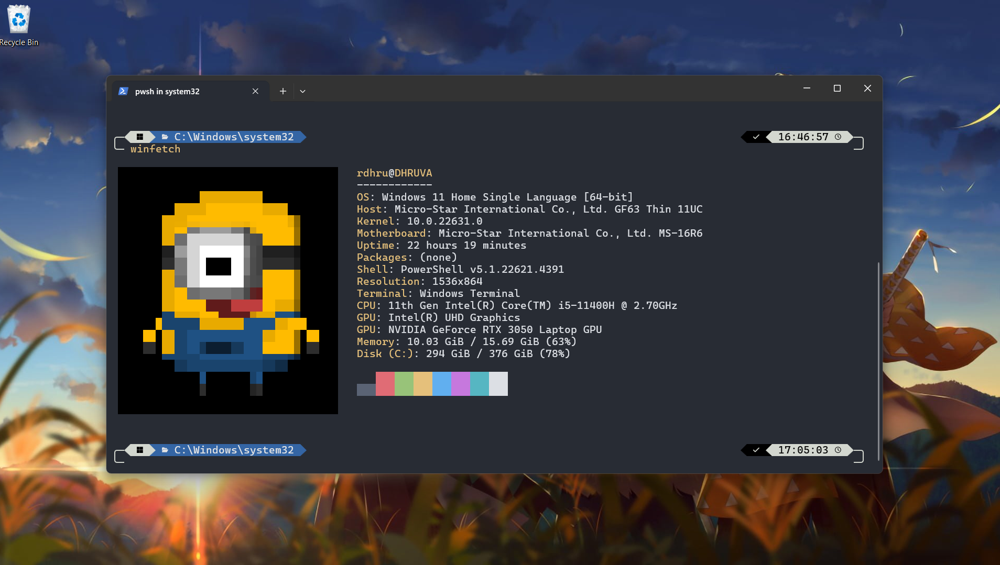
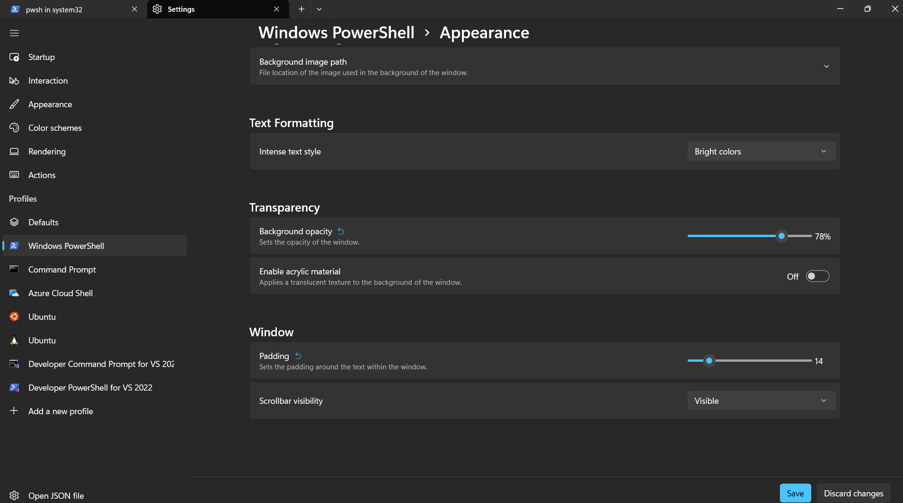

Beep Beep!!! Wanna change your Terminal, Don't Worry i am here, This blog are divided in the into three segments. Before we start, If you dont have window terminal download it Buddy [Window Terminal](https://www.microsoft.com/en-us/p/windows-terminal/9n0dx20hk701).<br />
I’ll show you how to customize the hell out of Windows Terminal so that you can flex on your friends and colleagues 😎.<br />

This is my Terminal design

so, I am telling you this blog contain three segments.
- **Oh my posh**
- **Winfetch**
- **Window Terminal Settings**
## 1. Oh my posh

**Oh My Posh** is a tool that lets you customize and beautify your command line prompt with themes, icons, and dynamic information (like Git status, time, or system details). It works across various shells (e.g., PowerShell, Bash, Zsh) to make your terminal more visually appealing and functional.<br />
Open powershell prompt and run the following command :
```bash
winget install JanDeDobbeleer.OhMyPosh -s winget
```
if this command raising error remove `-s winget` and try again
1. After installing restart your window Terminal and prompt `oh-my-posh` in terminal to see if its correctly installed.
2. run this command in the root directory(in `C:\Users\User`)
```bash 
notepad $PROFILE
```
If notepad shows a prompt saying that “Microsoft.Powershell_profile.ps1” is not found and asks if you would like to create the file, Enter “Yes” to create the file.<br/>
After that notepad appear<br/>
paste this line in the notepad and save it.
```bash
oh-my-posh --init --shell pwsh --config ~/AppData/Local/Programs/oh-my-posh/themes/powerlevel10k_rainbow.omp.json | Invoke-Expression
winfetch
```
3. Restart your Terminal. Your Terminal should now load Oh My Posh automatically.

### Change themes
If you don't like this theme No worries oh my posh bring with more than 70 themes with them. Check out the [Themes](https://ohmyposh.dev/docs/themes) page documentation for a gallery of preinstalled themes. <br/>

All themes are located in `~\AppData\Local\Programs\oh-my-posh\themes` if you used `winget` to install Oh My Posh. If you used an alternative installation method, visit the documentation and select your installation method to see where the themes are located.
<br/>
I think you liked one theme from all of them right!!. Then open Terminal run command
```bash
note $PROFILE
```
Now, change the theme name `powerlevel10k_rainbow` to your liked theme.
`~/AppData/Local/Programs/oh-my-posh/themes/powerlevel10k_rainbow.omp.json`

## 2. Winfetch
We’ll install winfetch, a tool that shows your computer’s info in the command line. It’s a good option instead of neofetch, which only works on Linux.

1. Run your Terminal as Administrator,

2. Run this Command.
```bash
Install-Script winfetch
```
Choose “Yes” for any prompts you encountered.
3. Restart your Terminal to see `Winfetch` is installed correctly or not.

The default winfetch config is saved to `~\.config\winfetch\config.ps1`. Check out the “Configuration” wiki page to see all available configuration options.

### Change Image of winfetch ui
We can change the left image that you can see in terminal,I am using this image currently.

**Note:** Terminal supports pixel images.
1. Save this image in any location that you want. I keep this image in the root folder (`~`) with `minion.png`.
2. Open `~\.config\winfetch\config.ps1` in Notepad. Change the first two variables to the following:

**Note:** I used absolute path in $image because winfetch in my PC is having trouble processing a relative path (`~/minion.png`). The full path of my root folder is `C:\Users\User`.
3. Save the file and run `winfetch` in Terminal:

Wooooohhh!! you got it buddy!!🎉🎉.<br/>
we completed around 80% work now we have to set only font and icon that theme supports.

## 3. Window Terminal Settings
You can open settings via the `Ctrl+,` shortcut or the dropdown menu:

1. Go to powershell tab on left side in setting and open appearance


2. I am using `CaskaydiaMono Nerd Font Mono` font face currently and On one half dark for color scheme, you can make it own and there are lot of color scheme available.

if `CaskaydiaMono Nerd Font Mono` is not installed in your system then [download and install it](https://www.nerdfonts.com/font-downloads). 

4. You can also change background opacity and padding in the appearance tab.

And your terminal become this...

<br/>
That’s all the steps you needed to beautify your Terminal 🌈. Now it’s time for you to show off in front of your friends and colleagues! 😁<br/>

Thanks for reading! If you find it useful, don’t forget to like and share this post 🙌
