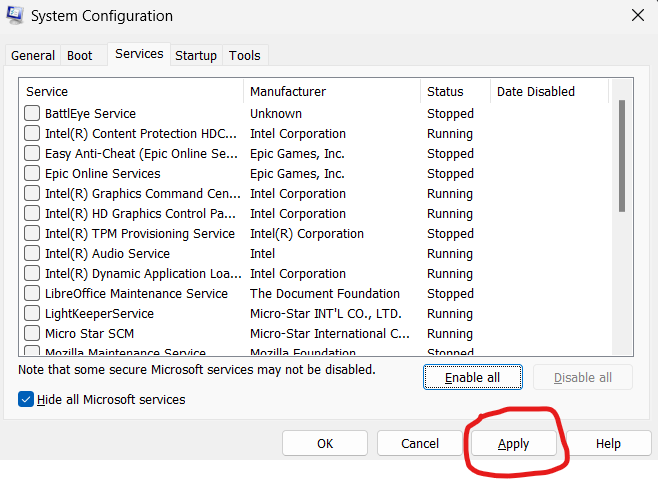
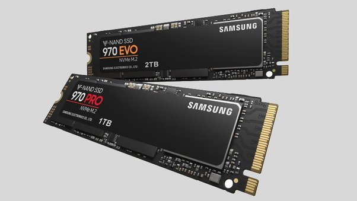

Think about the time when you got your new laptop. It was fast and worked perfectly. But as time goes on, your laptop might start getting slower. It might take a long time to start up, open programs, or do simple tasks. This can make you feel annoyed, especially when you need to get important work done.  

Laptops slow down for many reasons. Some common causes are not having enough memory, too many programs installed, or having viruses and malware.  

Did you know that over 80% of people around the world use laptops for work, school, or fun? Out of those, about half face issues with their laptops being slow. This can be really frustrating and stop them from working properly.  

But don't worry! The good news is there are simple things you can do to make your laptop faster and work like new again.  

Here are some easy tips to check and fix your laptop if it is running slow.

## Disable your start-up programs
The first step in speeding up an old laptop  is to look at the programs its running. Programs can take up a lot of processing power, which impact your laptop's performanceand speed, Some programs use very few resources when they're running idle;other use a lot of processing and memory power. Discovering which programs could be slowing down your laptop is the first step.

To prevent programs from starting automatically, follow these steps:
- Press the `Ctrl`+`Alt`+`Delete` keys at the same time.
- Select Task Manager.
- Click the Startup tab.
- Look through the list of programs and right click on any you don't want to start automatically.
- Select Disable.

Depending on how many programs you prevent from starting automatically, you should see a faster start-up time. After starting up, your laptop should also run faster because you've freed up the resources that were running these programs in the background.

## 1. Delete temporary files
Deleting Temp files or Temporary files twice a week makes your laptop faster. In PCs, temporary files are created and stored when using graphics, video or media editing software, etc.  Generally, these files consume more space in your system.
 `Press WIN key + R `-> `Type “%temp%” and Enter` -> `Press Ctrl + A` ->  `Press Shift + Delete` -> `Click “Yes”`
Select all the File Delete them.

- ### Using Msconfig
    There are some unnecessary services are running in the background, you can Check in Task Manager(`Ctrl`+`Alt`+`Del`)
      `Press WIN key + R`-> `Type "msconfig and Enter"` ->`select services tab`->`hide microsoft services` ->`Disable all service and hit apply`
     This step disable all unnecessary process that are running in your background sometime time, some application requires the background services so you can select that related service application on the msconfig.
    
## 2. Optimize your Web Browser

If you notice that your laptop is running slowly when you're on the web, check that you have the most recent version of your web browser installed. Although the location of version information varies by browser, there will always be an "About" selection to show you. If there is an option to install new versions automatically, then enable it.

Having too many add-ons and extensions can also slow your web browsing. Again, it depends on your browser, but you should be able to find a menu called "Add-ons" or "Extensions" that will allow you to delete any add-ons and extensions you don't want.
If You have low end pc then i recommend you to use **brave** and **Firefox** web browser

## 3. Remove application with Bulk Crap Uninstaller
It Happen most of the time you uninstall the application from add or Remove program fully but most of the files and services are not deleted. 
 Then What we will do??
Don't worry guys seekh code will assist you Just download  [Bulk Crap Uninstaller](https://www.bcuninstaller.com/) bcuninstaller is the open source application that delete all remaining files.

## 4. Clean up your Disk with WinDirStat
[WinDirStat](https://windirstat.net/download.html) is a strong contender for the best storage space analysis software. Its interface allows you to see exactly what's using space on your hard drive at a glance. When you launch WinDirStat, you can tell it to scan all local drives, a single drive like your C: drive, or a specific folder on your computer.

After it finishes scanning, you'll see three panes. On top, there's a directory list that shows you the folders using the most space in descending order. On the bottom, there's a "treemap"

view that shows you a color-coded view of what's using space. On the right, there's a file extension list that shows you statistics about which file types are using the most space. It also serves as a legend, explaining the colors that appear in the bottom of the window.

For example, when you click a directory in the directory list, you'll see the contents of that directory highlighted in the treemap. You can mouse over a square in the treemap to see what file it represents. You can also click a file extension in the list to see exactly where files of that type are located in the treemap view. Right-click a folder in the directory list and you'll see options to quickly delete that folder or open it in Explorer.

WinDirStat will help you to find the software, application or whatever taking large storage in your drive then you can easily delete it.

## 5. Upgrade RAM memory:
Many people have good laptops, but they don't always perform at their best because of limited RAM. Check two things Before buying the RAM :

    - Check Your Laptop's Current RAM: Find out the speed (e.g., 2400MHz) and type (DDR4 or DDR3) of the RAM already installed. This helps you buy the right match.
    - Check Compatibility: Make sure the new RAM you buy works with your motherboard. Check your laptop's specifications or consult the manufacturer's website.
## 6. Defragment your hard drive

This step is only applicable if your laptop uses a hard drive rather than an SSD. If you already have an SSD, you can skip this step.

You may need to [defragment a hard drive](https://www.crucial.in/articles/pc-users/how-to-defrag-hard-drive) because HDDs access information sequentially; having information in multiple places fragments increases the time the drive takes to access the data. Defragmenting defragging your hard drive moves data on the HDD into a logical formation, making it quicker to access.

**Most of the Time these are the reason that your laptop is slowing down, it's because of one, or more, of these:**

    - Bad sectors on the HDD.
    - Fragmented HDD (Do a defrag & see what results).
    - Computer Virus.
    - Overloaded HDD (never have more than 85% space used).
    - A cluttered registry (a registry cleaner like AVG PC Tuneup helps here).

**Tip** - Use ublock origin extension in your browser to prevent your laptops from unwanted popup ads and virus fully software.

