<br/>Star pattern problems are a fun way to practice Python coding. It feels great to see shapes like triangles or diamonds appear on your screen, all made from stars (*). These patterns are simple to start with but can get really interesting as you try new ideas. They're perfect for beginners to learn loops and for anyone who enjoys a creative coding challenge!
#### Lets start!
Pattern Programs in Python
    - Star Patterns in python
    - Numeric Patterns
    - Character Patterns


Let's start common question  that generally asked in the interview.
## Pyramid Patterns Problem
### 1. Full Pyramid
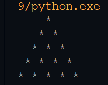
```py

# Set the number of rows for the pyramid
rows = 5

# Loop through each row
for i in range(1, rows + 1):
    # Print spaces to push the stars to the center
    print(" " * (rows - i), end="")
    # Print stars, with a space after each star
    print("* " * i)

```
Awesome! buddy you got it :-\)! <br/>
We still have a long way to go to stay motivated.

### 2. Right Triangle or Half Pyramid
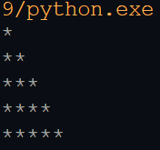

```py

# Set the number of rows for the triangle
rows = 5

# Loop through each row
for i in range(1, rows + 1):
    print("*" * i)
```
I know it is simple than the previous one. Let's try interesting one.

### 3. Downward Half Pyramid 
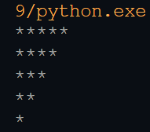
```py 

# Set the number of rows for the pyramid
rows = 5

# Loop through each row, starting from the largest
for i in range(rows, 0, -1):
    # Print stars for the current row
    print("*" * i)
```
### 4. Right Start Pyramid
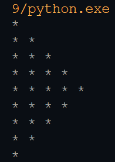
Don't Worry Buddy Apply the logic of the previous two problems.
```py
rows = 5

for i in range (0, rows):
    for j in range(0, i + 1):
        print("* ", end='')
    print("\r")
for i in range (rows, 0, -1):
    for j in range(0, i -1):
        print("* ", end='')
    print("\r")
```
### 5.Hollow Pyramid 
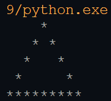
```py
rows = 5

# Printing the hollow pyramid pattern
for i in range(1, rows + 1):
    # Printing leading spaces
    for j in range(rows - i):
        print(" ", end="")

    # Printing stars and spaces in the pyramid
    for j in range(1, 2 * i):
        if j == 1 or j == 2 * i - 1 or i == rows:  # Stars at the boundaries and base row
            print("*", end="")
        else:
            print(" ", end="")

    print()  # Move to the next line
```
Now, Try Diamond star pattern questions.


## Diamond pattern problem
### 6. Diamond Pattern
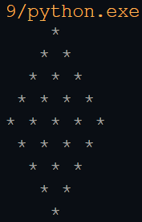
```py
rows = 5
# Printing upper half of the pattern
for i in range(1, rows + 1):
    # Printing rows-i spaces at the beginning of each row
    for j in range(1, rows - i + 1):
        print(" ", end="")

    # Printing i stars at the end of each row
    for j in range(1, i + 1):
        print("*", end=" ")

    print()

# Printing lower half of the pattern
for i in range(rows - 1, 0, -1):
    # Printing rows-i spaces at the beginning of each row
    for j in range(1, rows - i + 1):
        print(" ", end="")

    # Printing i stars at the end of each row
    for j in range(1, i + 1):
        print("*", end=" ")

    print()

```
### 7. Hollow Diamond Pattern
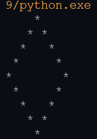
```py
rows = 5

# Printing the upper half of the diamond
for i in range(1, rows + 1):
    # Printing leading spaces
    for j in range(rows - i):
        print(" ", end="")
    
    # Printing stars and spaces in the upper half
    for j in range(1, 2 * i):
        if j == 1 or j == 2 * i - 1:  # First and last position in the row
            print("*", end="")
        else:
            print(" ", end="")
    
    print()  # Move to the next line

# Printing the lower half of the diamond
for i in range(rows - 1, 0, -1):
    # Printing leading spaces
    for j in range(rows - i):
        print(" ", end="")
    
    # Printing stars and spaces in the lower half
    for j in range(1, 2 * i):
        if j == 1 or j == 2 * i - 1:  # First and last position in the row
            print("*", end="")
        else:
            print(" ", end="")
    
    print()  # Move to the next line
```


## Square Patter Problems
### 8. Solid Square
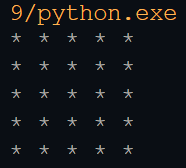
```py
size = 5

# Loop through rows
for i in range(size):
    # Print stars for each column in the row
    for j in range(size):
        print("*", end=" ")
    # Move to the next line after printing all columns in the current row
    print()

```
### 9. hollow Square
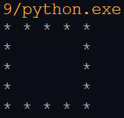
```py
size = 5

# Loop through rows
for i in range(size):
    # Loop through columns
    for j in range(size):
        # Print '*' for the border (first and last row, or first and last column)
        if i == 0 or i == size - 1 or j == 0 or j == size - 1:
            print("*", end=" ")
        else:
            print(" ", end=" ")
    # Move to the next line after printing the current row
    print()
```
## Miscellaneous Patterns
### 10. Pattern - 1
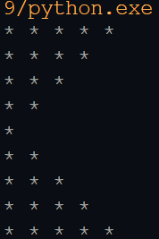
```py
rows = 5

# Printing upper half of the pattern
for i in range(rows, 0, -1):
    for j in range(1, i + 1):
        print("*", end=" ")
    print()

# Printing lower half of the pattern
for i in range(2, rows + 1):
    for j in range(1, i + 1):
        print("*", end=" ")
    print()
```
### 11. Pattern - 2
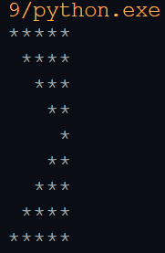
```py
rows = 5

# Printing upper half of the pattern
for i in range(1, rows + 1):
    # Printing i spaces at the beginning of each row
    for j in range(1, i):
        print(" ", end="")

    # Printing i to rows value at the end of each row
    for j in range(i, rows + 1):
        print("*", end="")
    
    print()

# Printing lower half of the pattern
for i in range(rows - 1, 0, -1):
    # Printing i spaces at the beginning of each row
    for j in range(1, i):
        print(" ", end="")
    
    # Printing i to rows value at the end of each row
    for j in range(i, rows + 1):
        print("*", end="")
    
    print()
```
### 12. Pattern - 3
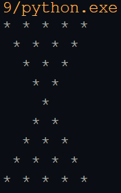
```py
rows = 5

# Printing upper half of the pattern
for i in range(1, rows + 1):
    # Printing i spaces at the beginning of each row
    for j in range(1, i):
        print(" ", end="")

    # Printing i to rows value at the end of each row
    for j in range(i, rows + 1):
        print("*", end=" ")

    print()

# Printing lower half of the pattern
for i in range(rows - 1, 0, -1):
    # Printing i spaces at the beginning of each row
    for j in range(1, i):
        print(" ", end="")

    # Printing i to rows value at the end of each row
    for j in range(i, rows + 1):
        print("*", end=" ")

    print()
``` 
### 13. Butterfly Pattern
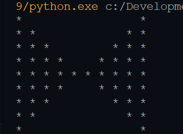
```py
rows = 5

# Printing upper half of the pattern
for i in range(1, rows + 1):
    # Printing the first set of stars
    for j in range(1, i + 1):
        print("*", end=" ")

    # Printing spaces between the two sets of stars
    for j in range(1, 2 * (rows - i) + 1):
        print("  ", end="")

    # Printing the second set of stars
    for j in range(1, i + 1):
        print("*", end=" ")

    print()

# Printing lower half of the pattern
for i in range(rows - 1, 0, -1):
    # Printing the first set of stars
    for j in range(1, i + 1):
        print("*", end=" ")

    # Printing spaces between the two sets of stars
    for j in range(1, 2 * (rows - i) + 1):
        print("  ", end="")

    # Printing the second set of stars
    for j in range(1, i + 1):
        print("*", end=" ")

    print()
```
### 14. Pattern - 4 
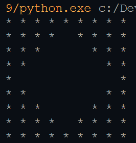
```py
star = '*'
res = -1

# Top half of the pattern
for i in range(5, 0, -1):
    # Left side of the pattern
    for j in range(1, i + 1):
        print(f"{star:2}", end="")
    
    # Space in the middle
    for s in range(res, 0, -1):
        print("  ", end="")
    
    # Right side of the pattern
    for k in range(1, i + 1):
        if i == 5 and k == 5:
            continue
        print(f"{star:2}", end="")
    
    res += 2
    print()

# Bottom half of the pattern
res = 5
for i in range(2, 6):
    # Left side of the pattern
    for j in range(1, i + 1):
        print(f"{star:2}", end="")
    
    # Space in the middle
    for s in range(res, 0, -1):
        print("  ", end="")
    
    # Right side of the pattern
    for k in range(1, i + 1):
        if i == 5 and k == 5:
            break
        print(f"{star:2}", end="")
    
    res -= 2
    print()
```
**Tips:** When working with star patterns, focus on managing **leading spaces** (rows - i) and **star placement** (boundary stars or full stars) in each row. Break the task into two parts: first handle spaces, then apply conditions for stars or hollow spaces within the row.

This brings us to the end of the star pattern programs in python. I hope you found it informative and that it helped you understand Python Fundamentals, Thanks for reading!
