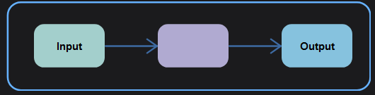
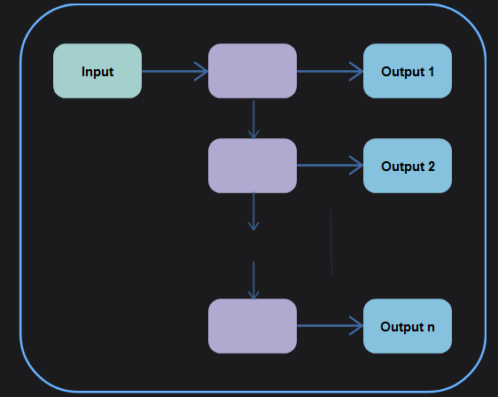
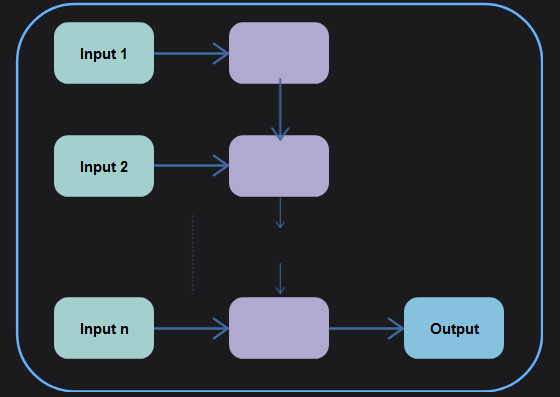
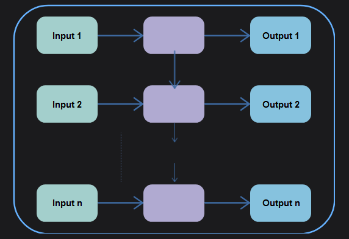

Recurrent neural networks, also known as RNNs, are a class of neural networks that allow previous outputs to be used as inputs while having hidden states.

The main and most important feature of RNN is its Hidden state, which remembers some information about a sequence. The state is also referred to as Memory State since it remembers the previous input to the network. It uses the same parameters for each input as it performs the same task on all the inputs or hidden layers to produce the output. This reduces the complexity of parameters, unlike other neural networks.

RNN has hidden layers that act as memory locations to store the outputs of a layer in a loop.

Visually, a typical RNN structure consists of a single computational unit with a self-connected hidden state, through which information cycles across timesteps:

## Unfolding RNN

Unfolding an RNN means laying out all the steps the RNN takes to process a sequence, so you can see how it changes as it goes through each part of the data. This helps in training and understanding how the RNN works.

We unfold an RNN to understand how it thinks and learns from each step. It's like rewinding and playing back a video to see each action frame by frame.

### 1. One to One

A one-to-one is the simplest type of RNN.It takes one input and produces one output. Think of it as a person who listens to a single word, processes it, and then speaks one response based on that word. There's no sequence involved here just a single step. The RNN remembers the input with its hidden state, which helps it produce the output.

In other words, a one-to-one handles just one input and one output at a time, like a basic question-answer interaction.

### 2. One to Many

A one-to-many takes one input and produces a sequence of multiple outputs over time, like starting with one word and generating a whole sentence from it.

### 3. Many to One

A many-to-one takes a sequence of multiple inputs and produces a single output.

It's like reading an entire paragraph (many inputs) and then summarizing it in one sentence (one output).

### 4. Many to Many

Many-to-Many is used to generate a sequence of output data from a sequence of input units.

This type of RNN is further divided into the following two subcategories:

Equal Unit Size: In this case, the number of both the input and output units is the same. A common application can be found in Name-Entity Recognition.

### 5. Many-to-Many (Equal)

Unequal Unit Size: In this case, inputs and outputs have different numbers of units. Its application can be found in Machine Translation.

### 6. Many-to-Many (Unequal)

## Benefits of RNN

**Some of the benefits provided by Recurrent Neural Networks are:**

Processes sequential data
Can memorize and store previous results
Takes into account both the current and the previous results in the computation of new results
Regardless of the increasing size of the input, the model size remains fixed
It shares weights to other units across time

## Limitations of RNN

**Below are some of the limitations of Recurrent Neural Networks:**

The computation time is slow as it is recurrent.
Unable to process a long sequence of information if using tanh or ReLU activation functions.
Cannot process future data in computation of current data.
Training is complicated.
Exploding Gradient: An exponential increase in model weights occur due to an accumulation of large gradient errors.
Vanishing Gradient: The gradients become too small and unable to make significant changes in the model weights.
