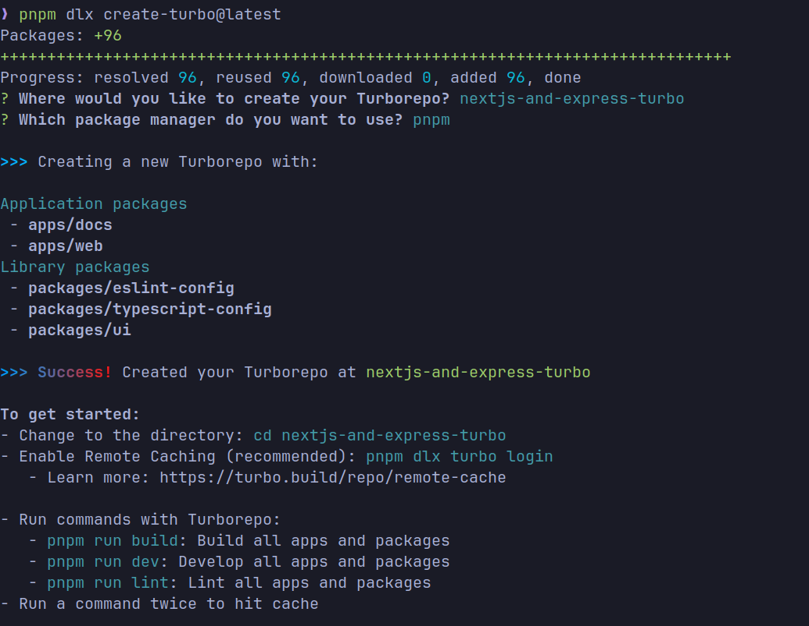
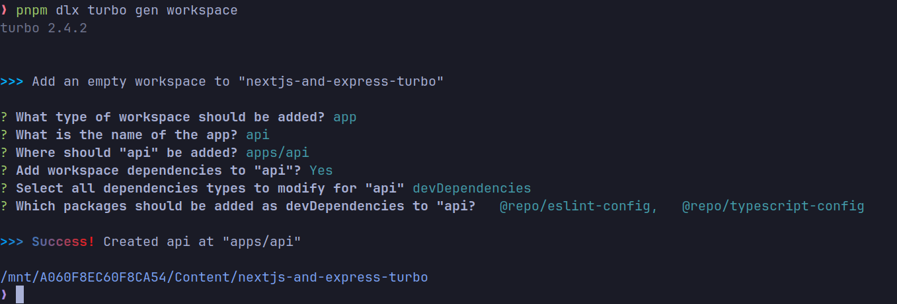
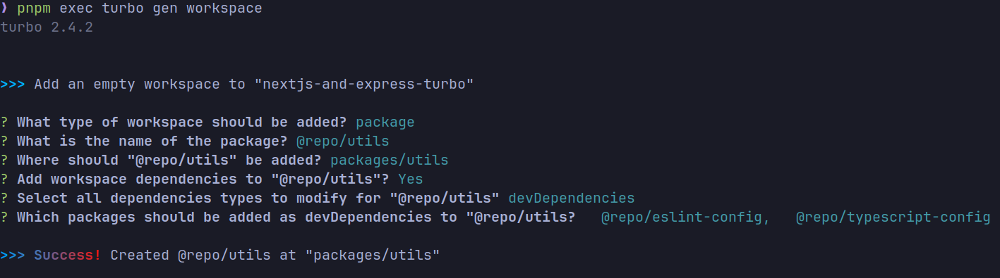
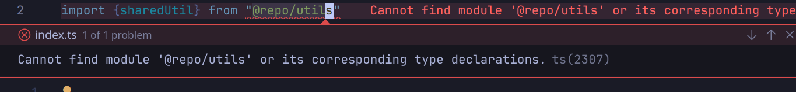
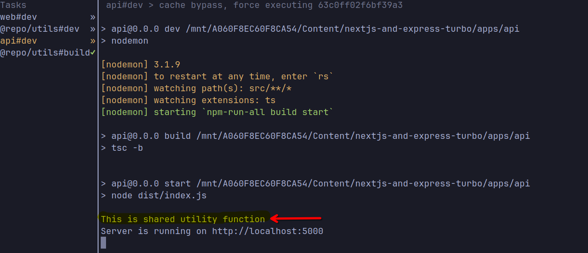
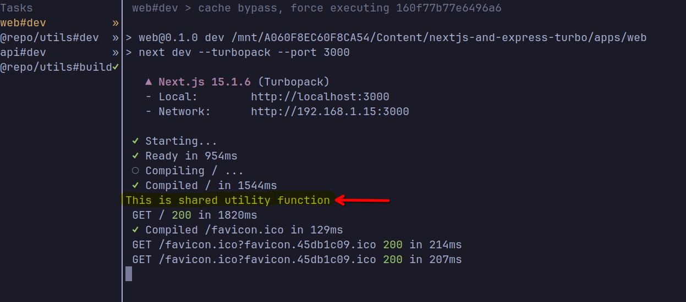

In this blog we will talk about how to setup a turborepo (monorepo) with nextjs as frontend and express js as the backend. This guide can we followed for any frameworks by just tweaking few steps.


### Why TurboRepo?
Turborepo makes managing and deploying monorepo a lot easier. It also have very good support for typescript and eslint as well. On the top of that you can use it with other languages as well.
Read more about turborepo [here](https://turbo.build/repo/docs)

---

### Initial Setup
We will use pnpm (as this is recommended by turborepo devs themselves) as the package manager for this project. You can install pnpm by running the following command.
```bash
## Method 1
npm i -g pnpm

## Method 2
corepack enable

# Verify that pnpm is installed
pnpm -v
```
**Note:** If you are on windows you might want to restart your terminal after installing pnpm

---

### Create a new project
Create a new project using the following command
```bash
pnpm dlx create-turbo@latest
cd <project-name>
```
You will be asked few questions, answer them as per your project requirements.


Make sure to select `pnpm` as your package manager, it will make your life a lot easier.


As turborepo is build by the same team who created nextjs, it defaults to nextjs as frontend and docs, but don't worry you can just go ahead and delete the docs and web folder and use your own framework.

As I am going to use nextjs and express, I will not delete the web folder, but I will delete the docs folder.


Lets delete the docs folder in the apps directory
```bash
rm apps/docs -r
```
---

### Lets create a App (api)
To create a new app you just do the following, you can follow same steps if you want to initiate vite or something else.
```bash
pnpm dlx turbo gen workspace
```
Make sure to install `devDependencies` such as `@repo/eslint-config` and `@repo/typescript-config` in the newly created app. This will help you to have a better development experience.



You will be asked few questions, answer them as per your project requirements. 

---

### Setting up API (Express)
```bash
pnpm --filter api add express
pnpm --filter api add @types/express typescript nodemon npm-run-all -D
```

Lets create a `tsconfig.json` file in the api folder
```json
{
  "extends": "@repo/typescript-config/tsconfig.json",
  "compilerOptions": {
    "outDir": "dist",
    "rootDir": "src"
  },
}
```
Add two scripts in the `package.json` file in the api folder
```json
...,
"scripts": {
  "dev": "nodemon",
  "build": "tsc -b",
  "start": "node dist/index.js"
}
...
```

Lets create a `nodemon.json` file in the api folder, although there are many tools but I still prefer nodemon.
```json
{
  "watch": ["src"],
  "ext": "ts",
  "ignore": ["dist"],
  "exec": "npm-run-all build start"
}
```

#### Create a basic API server
Lets create a basic express server in the `src/index.ts` file
```typescript
import express from 'express';

const app = express();
const PORT = process.env.PORT || 3000;

app.get('/', (req, res) => {
  res.send('Hello World');
});

app.listen(PORT, () => {
  console.log(`Server is running on http://localhost:${PORT}`);
});
```

Now make sure you are in the root directory of the project and run the following command
```bash
pnpm dev
```

Voila you have your express server running on `http://localhost:5000`


But wait, lets create a shared package as well. That's the part where people get confused and couldn't get it to work.

---

### Creating a shared package
We will use same command to create a workspace, but this time we will select `package` as the workspace type.
Also don't forget to install `@repo/eslint-config` and `@repo/typescript-config` as devDependencies in the newly created package.
```bash
pnpm dlx turbo gen workspace
```


Let's create a shared utility that can be used in both frontend and backend.
```bash
pnpm --filter @repo/utils add typescript nodemon -D

# You can omit nodemon if you want and can use tsc -w instead, but for this example I will use nodemon
```

Lets create a `tsconfig.json` file in the utils folder
```json
{
  "extends": "@repo/typescript-config/tsconfig.json",
  "compilerOptions": {
    "outDir": "dist",
    "rootDir": "src"
  },
}
```

Add two scripts in the `package.json` file in the utils folder
```json
...,
"scripts": {
  "dev": "nodemon",
  "build": "tsc -b"
}
...
```
Create a `nodemon.json` file in the utils folder
```json
{
  "watch": ["src"],
  "ext": "ts",
  "ignore": ["dist"],
  "exec": "npm run build"
}
```


Lets create a basic utility function in the `src/index.ts` file
```typescript
export function sharedUtil(){
  console.log('This is a shared utility function');
}
```
Lets add this shared utility in the api and web folder as well.
Edit package.json as follows
```json
...,
"dependencies": {
  ...,
  "@repo/utils": "workspace:*"
}
...
```
Install the packages using pnpm
```bash
pnpm i
```

Lets try to import the shared utility in the api and web folder
Edit `api/src/index.ts` and try to add this on top
```typescript
import { sharedUtil } from '@repo/utils';
```

But we are getting a following import error.


This is because we also need to tell package.json that we should export specific files from the shared package.
Edit the `package.json` file in the utils folder and add the following
```json
...,
"exports": {
  "default": "./dist/index.js",
  "types": "./dist/index.d.ts",
},
...
```

But we are still getting the same error, this is because we need to build the shared package first. But this would become very hard to maintain in large scale projects. Right?
Here comes the turborepo to the rescue.

You can specify on which packages/scripts your app depends, and turborepo will take care of building them in the right order.

Create a `turbo.json` in api directory and write the following
```json
{
  "$schema": "https://turbo.build/schema.json",
  "extends": ["//"],
  "tasks": {
    "dev": {
      "dependsOn": ["@repo/utils#build"]
    }
  }
}
```

Now, lets import the shared utility in the `api/src/index.ts` file
```typescript
import { sharedUtil } from '@repo/utils';
sharedUtil()
...
```


Also import it in the `web/app/page.tsx` file
```typescript
import { sharedUtil } from '@repo/utils';
sharedUtil()
...
```

Now run the following command in the root directory of the project
```bash
pnpm dev
```

We should see the following output in the terminal




Congratulations, you have successfully setup a turborepo with nextjs and express with typescript. You can now add more packages and apps as per your requirements.


---

### Additional Steps
You can also setup a nextjs proxy to the express server, so that you can use the same domain for both frontend and backend. You can do this by adding the following code in the `web/next.config.js` file
```typescript
/** @type {import('next').NextConfig} */
const nextConfig = {
  async rewrites(){
    return [
      {
        source: '/api/:path*',
        destination: 'http://localhost:3001/api/:path*',
      },
    ]
  }
};

export default nextConfig;
```


Thank you for reading, I hope this blog was helpful to you. If you have any questions or suggestions, feel free to comment below.


In the next blog we will talk about how to deploy this project using docker. Stay tuned.